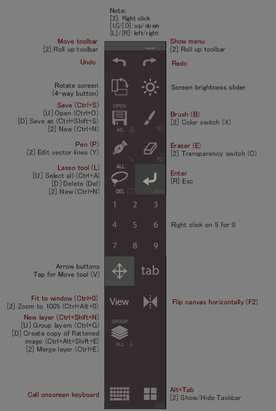

# Toolbar Creator template
***for Photoshop (R) and ClipStudio Paint aka. Manga Studio (R)***  

**Toolbar Creator** is one of few especially useful on-screen toolbars for Windows Tablet PCs. It makes using Windows tablets without keyboard much more comfortable and convenient. The software is developed by [**lblb**](http://forum.tabletpcreview.com/threads/toolbar-creator-v-2-2-beta-available-for-download.63014/) at TabletPC Review forum, which is a UI-friendly front-end for `RawInputControlTest` script by [**koide**](http://39kasen.sakura.ne.jp/rawinputcontroltest/).

This repository is a toolbar *template*, specifically designed for painting in Adobe (R) Photoshop (R) and ClipStudio Paint aka. Manga Studio (R). Icon design is kindly provided by [**gahfe**](http://forum.tabletpcreview.com/threads/slatepal-dock-developing.54774/) at TabletPC Review forum. The template was created, ***assuming*** that modifier keys (Ctrl, Alt, Shift) reside on an external harware device, eg. keyboard, tablet buttons, gamepad etc. I have mine on a [Zeemote controller](http://i.imgur.com/Z8ivi4l)
## Screenshot

## Logs
-  template for v2.2 beta 5 with more buttons added

## Installation instructions
0. *(for non-GitHub users)* Click [here](https://github.com/hemiolan/Toolbar-Creator/archive/master.zip), then extract the downloaded file into a folder, and go into `Toolbar-Creator-master\` folder.
1. Copy and paste folder `[version]\Files` into your `Toolbar Creator` folder. 
`[version]` is either `v2_1` or `v2_2_b5` accordingly to your existing `Toolbar Creator` version.
2. Replace/Merge all existing files/folders if prompted.
3. Launch Toolbar Creator and change the current toolbar to `painting`.
